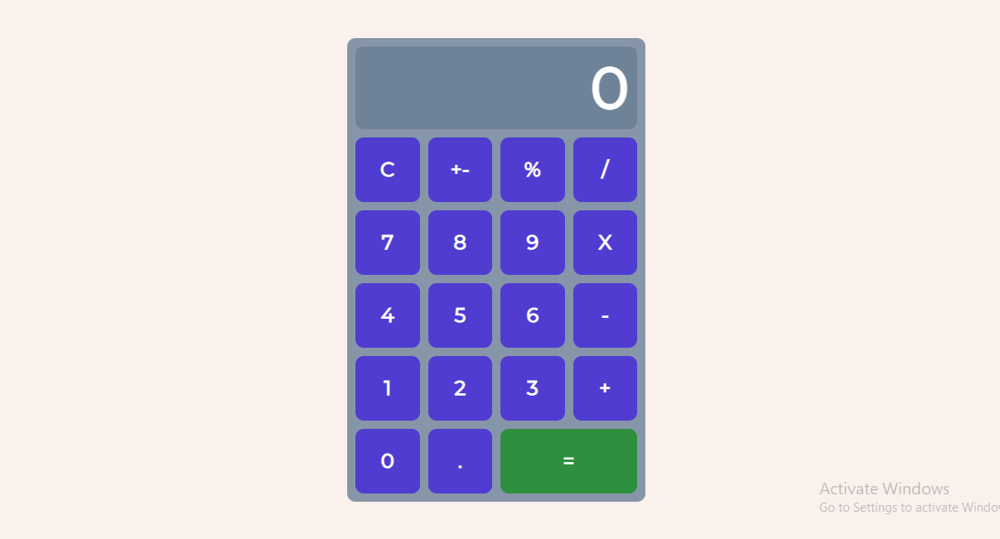

# React Calculator

A calculator project built with React and nodejs.

## Features

1. Add, subtract, multiply, divide
2. Support decimal values
3. Calculate percentages
4. Invert the values
5. Reset functionality
6. Format larger numbers
7. Output resize based on length

## Installation (Frontend)

1. `git clone https://github.com/n-jabes/n-jabes-calculator`

2. `cd n-jabes-calculator`

3. `cd frontend`

4. `npm install`

5. `npm start`

## Installation (Backend)

1. `git clone https://github.com/n-jabes/n-jabes-calculator`

2. `cd n-jabes-calculator`

3. `npm install`

4. `npm start`

5. `npm run test`

## Contributions

Any feature requests and pull requests are welcome!

